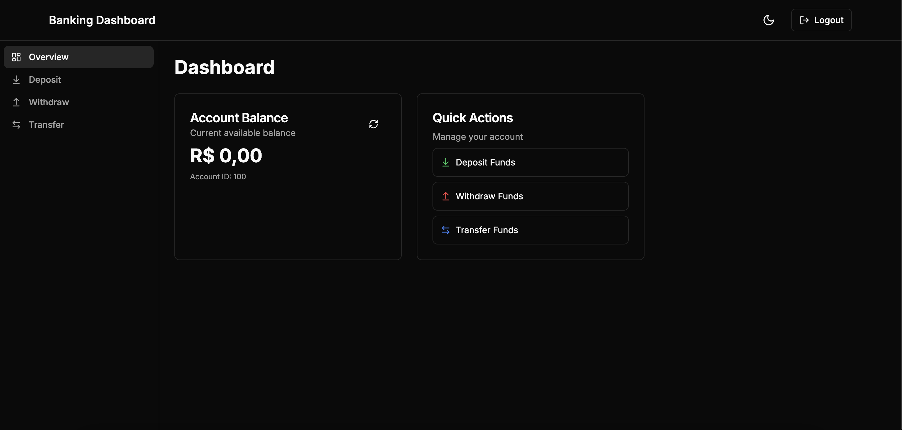
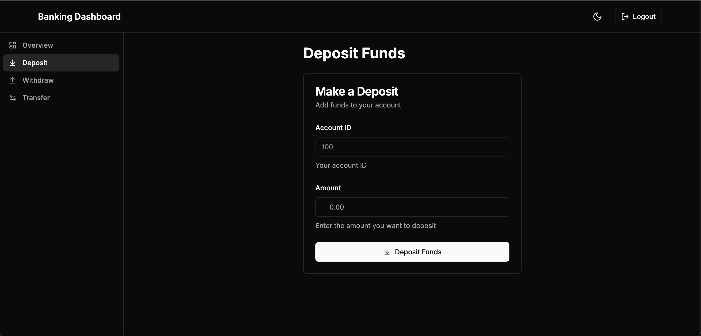
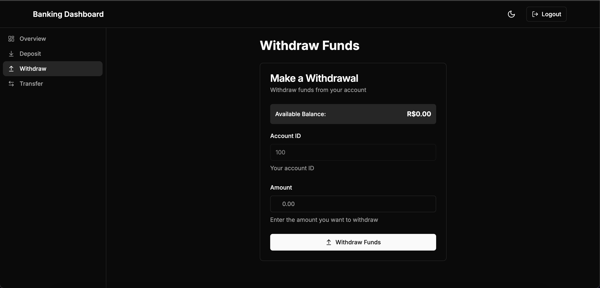
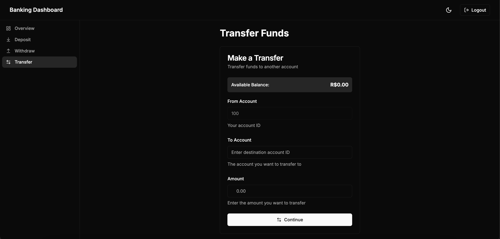

# Bank Account

Este projeto consiste em uma API que simula uma conta bancária em Node.js. A API permite operações como criação de conta, depósitos, saques, transferências e consulta de saldo. Além disso, é necessário autenticação para acessar os endpoints protegidos.

---

## Tecnologias Utilizadas

- **Backend**: NestJS (Node.js)
- **Frontend**: Next.js + TailwindCSS
- **Banco de Dados**: Em memória (utilizando Map)
- **Autenticação**: JWT
- **Testes**: Jest
- **Containerização**: Docker e Docker Compose

---

## Configuração do Ambiente

### Requisitos

- Docker e Docker Compose instalados
- Node.js 18+ e npm/yarn (caso execute sem Docker)

### Executando com Docker

```sh
docker-compose up --build
```

Isso irá subir tanto o frontend quanto o backend.

Caso queira rodar apenas o backend:

```sh
docker-compose up backend
```

E para rodar apenas o frontend:

```sh
docker-compose up frontend
```

### Executando localmente sem Docker

#### Backend

```sh
cd backend
npm install
npm run start
```

#### Frontend

```sh
cd frontend
npm install
npm run dev
```

### Resumo do Teste

#### Autenticação

O único login cadastrado é:

```dash
Usuário: admin
Senha: admin
```

#### Frontend

O frontend está configurado para utilizar a conta 100, definida através de variáveis de ambiente.

---

## Endpoints da API

### Autenticação

| Método | Endpoint | Corpo (JSON)                               | Retorno  |
| ------ | -------- | ------------------------------------------ | -------- |
| POST   | `/login` | `{ "username": "admin", "pass": "admin" }` | `200 OK` |

> **Nota**: As demais operações requerem autenticação.

---

### Resetar o estado antes dos testes

| Método | Endpoint | Corpo | Retorno  |
| ------ | -------- | ----- | -------- |
| POST   | `/reset` | -     | `200 OK` |

---

### Consultar saldo

| Método | Endpoint   | Parâmetros                       | Retorno  |
| ------ | ---------- | -------------------------------- | -------- |
| GET    | `/balance` | `?account_id=100`                | `200 20` |
| GET    | `/balance` | `?account_id=1234` (inexistente) | `404 0`  |

---

### Criar conta e realizar depósitos

| Método | Endpoint | Corpo (JSON)                                                | Retorno                                                 |
| ------ | -------- | ----------------------------------------------------------- | ------------------------------------------------------- |
| POST   | `/event` | `{ "type": "deposit", "destination": "100", "amount": 10 }` | `201 { "destination": { "id": "100", "balance": 10 } }` |
| POST   | `/event` | `{ "type": "deposit", "destination": "100", "amount": 10 }` | `201 { "destination": { "id": "100", "balance": 20 } }` |

---

### Saques

| Método | Endpoint | Corpo (JSON)                                            | Retorno                                            |
| ------ | -------- | ------------------------------------------------------- | -------------------------------------------------- |
| POST   | `/event` | `{ "type": "withdraw", "origin": "100", "amount": 5 }`  | `201 { "origin": { "id": "100", "balance": 15 } }` |
| POST   | `/event` | `{ "type": "withdraw", "origin": "200", "amount": 10 }` | `404 0`                                            |

---

### Transferências

| Método | Endpoint | Corpo (JSON)                                                                  | Retorno                                                                                          |
| ------ | -------- | ----------------------------------------------------------------------------- | ------------------------------------------------------------------------------------------------ |
| POST   | `/event` | `{ "type": "transfer", "origin": "100", "amount": 15, "destination": "300" }` | `201 { "origin": { "id": "100", "balance": 0 }, "destination": { "id": "300", "balance": 15 } }` |
| POST   | `/event` | `{ "type": "transfer", "origin": "200", "amount": 15, "destination": "300" }` | `404 0`                                                                                          |

---

## Screenshots 📸



<br />



<br />



<br />


